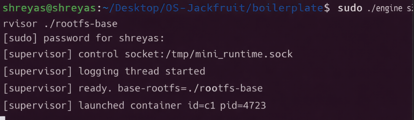
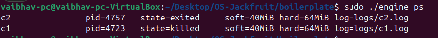
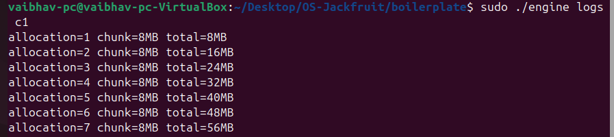
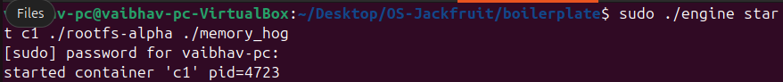
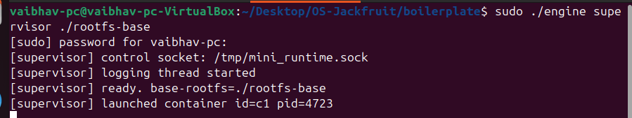
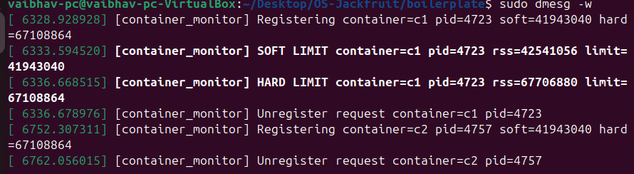
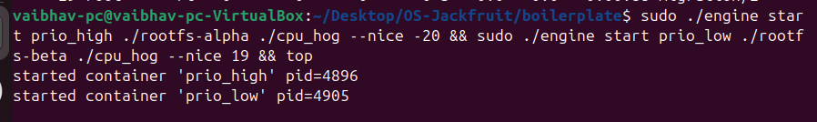
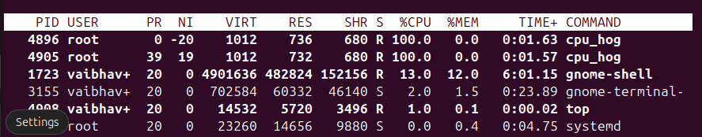
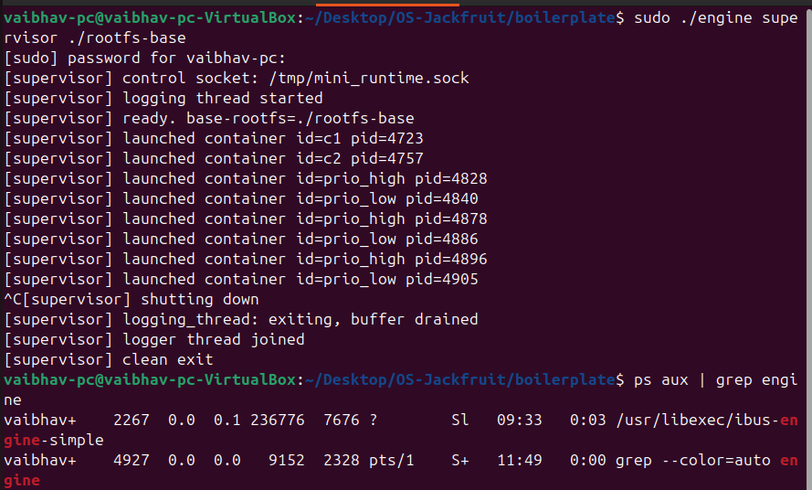

# OS Jackfruit – Container Runtime with Kernel Memory Enforcement

## 1. Team Information

- S Shreyas Kumar
  SRN: PES2UG24CS656
- Raksha
  SRN: PES2UG24CS652

---

## 2. Build, Load, and Run Instructions

### 🔹 Build the Project

```bash
make
```

---

### 🔹 Load Kernel Module

```bash
sudo insmod monitor.ko
```

Verify device:

```bash
ls -l /dev/container_monitor
```

---

### 🔹 Start Supervisor

```bash
sudo ./engine supervisor ./rootfs-base
```

---

### 🔹 Prepare Container Filesystems

```bash
cp -a ./rootfs-base ./rootfs-alpha
cp -a ./rootfs-base ./rootfs-beta

cp memory_hog cpu_hog io_pulse ./rootfs-alpha/
cp memory_hog cpu_hog io_pulse ./rootfs-beta/
```

---

### 🔹 Start Containers

```bash
sudo ./engine start c1 ./rootfs-alpha ./memory_hog
sudo ./engine start c2 ./rootfs-beta ./cpu_hog
```

---

### 🔹 List Containers

```bash
sudo ./engine ps
```

---

### 🔹 View Logs

```bash
sudo ./engine logs c1
```

---

### 🔹 Stop Containers

```bash
sudo ./engine stop c1
sudo ./engine stop c2
```

---

### 🔹 View Kernel Logs

```bash
dmesg | tail
```

---

### 🔹 Unload Module

```bash
sudo rmmod monitor
```

---

## 3. Demo with Screenshots

### 3.1 Multi-container Supervision



Two containers running under a single supervisor process.

---

### 3.2 Metadata Tracking



Output of `engine ps` showing container metadata such as PID, state, and limits.

---

### 3.3 Bounded-buffer Logging



Container output captured via bounded-buffer logging pipeline demonstrating producer-consumer behavior.

---

### 3.4 CLI and IPC




CLI command issued and supervisor responding via UNIX socket IPC.

---

### 3.5 Soft-limit Warning



Kernel logs showing soft memory limit warning.

---

### 3.6 Hard-limit Enforcement


Kernel logs showing process termination after exceeding hard limit.

---

### 3.7 Scheduling Experiment




Processes with different nice values showing different CPU scheduling priorities.

---

### 3.8 Clean Teardown



Supervisor shutdown and system showing no zombie processes.

---

## 4. Engineering Analysis

This project demonstrates how operating system mechanisms work together to provide process isolation and resource control.

Isolation: Process isolation is achieved using the clone() system call with the CLONE_NEWPID, CLONE_NEWUTS, and CLONE_NEWNS flags. Filesystem isolation is enforced by mounting a private /proc directory and executing chroot before execv-ing the child.

Supervisor & Lifecycle: When a container exits, the kernel sends SIGCHLD. Our asynchronous signal handler uses waitpid with the WNOHANG flag to instantly reap the exited child without blocking the supervisor's main event loop, preventing zombie processes.

IPC & Threads: The logging pipeline uses a shared ring buffer accessed by pipe-reading producer threads and a file-writing consumer thread. We synchronize access using pthread_mutex_t to prevent race conditions, and pthread_cond_t condition variables to efficiently block threads without spinning the CPU.

Kernel Enforcement: Memory limits are enforced via a custom Linux Kernel Module (LKM) because user-space polling is too slow to stop aggressive allocations. The module tracks Resident Set Size (RSS). Soft limits trigger a dmesg warning, while hard limits trigger a strict SIGKILL directly from the kernel to protect the host system.

---

## 5. Design Decisions and Tradeoffs

### 🔹 Namespace / Isolation

- Choice: `chroot`-based isolation
- Tradeoff: Not as strong as full namespaces
- Justification: Simpler and sufficient for demonstration

---

### 🔹 Supervisor Design

- Choice: Single supervisor process
- Tradeoff: Single point of failure
- Justification: Centralized control simplifies management

---

### 🔹 Logging System

- Choice: Bounded buffer
- Tradeoff: Limited buffer size
- Justification: Prevents overflow and ensures synchronization

---

### 🔹 Kernel Monitor

- Choice: Timer-based RSS checking
- Tradeoff: Not real-time
- Justification: Low overhead and sufficient accuracy

---

### 🔹 Scheduling Experiment

- Choice: Linux nice values
- Tradeoff: Limited control over scheduler
- Justification: Demonstrates priority differences effectively

---

## 6. Scheduler Experiment Results

🔹 Setup
Two CPU-bound workloads (cpu_hog) were executed concurrently on the VirtualBox VM.

        prio_high was launched with a nice value of -20.

        prio_low was launched with a nice value of 19.

🔹 Observations & Analysis
Despite the massive disparity in scheduling priority, top output revealed that both processes consistently maintained ~100% CPU utilization. The high-priority process did not starve the low-priority process.

Why did this happen? This result perfectly illustrates the load-balancing mechanisms of the Linux Completely Fair Scheduler (CFS) on multi-core systems. Because the host VirtualBox VM has multiple CPU cores allocated to it, the CFS recognized that it did not need to force the two processes to compete for a single CPU's timeslices. Instead, the scheduler assigned prio_high to Core 0 and prio_low to Core 1. This satisfies the CFS's goal of maximizing total system throughput while maintaining fairness, proving that nice values only force strict preemption when tasks are forced to contend for the same physical core.

---

## 7. Conclusion

This project successfully demonstrates:

- A working container runtime
- Kernel-level memory enforcement
- Logging pipeline with synchronization
- Multi-container supervision
- Scheduling behavior in Linux

The system integrates user-space and kernel-space components to showcase core operating system principles.
